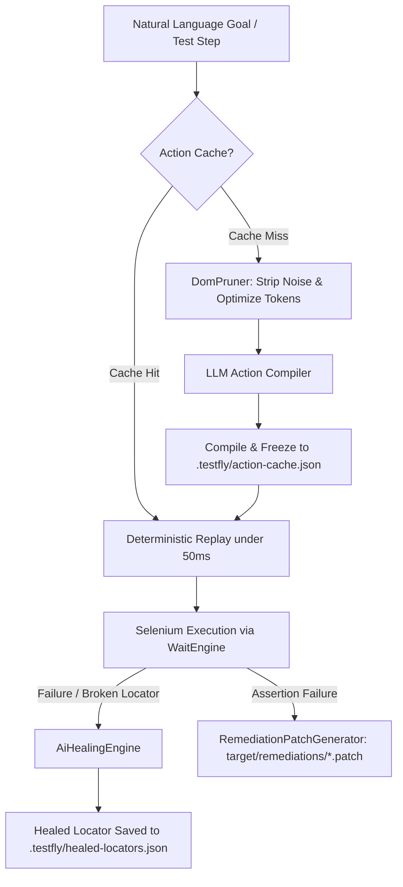

# Agentic Testing & Autonomous AI in TestFly

Traditional test automation requires test engineers to imperatively script every single step and selector. When an application's DOM structure, ID, or styling changes, tests break immediately.

**TestFly Agentic Testing** introduces autonomous AI capabilities directly into the test runtime while preserving strict Java 17 performance, deterministic execution, and `@TestFlyApi` stability.



---

## 1. AI-Driven Self-Healing

When a selector breaks due to front-end refactorings, TestFly first attempts fast static regex fallbacks (such as ID extraction, name attributes, and exact text matches). If all static fallbacks fail and `locators.aiHealing: true` is configured, TestFly activates the **AiHealingEngine**:

1. **Token-Budgeted DOM Pruning (`DomPruner`):**  
   Strips `<script>`, `<style>`, `<iframe>`, inline SVGs, comments, and non-interactive nodes, reducing typical 100K+ token DOM trees to under 8K tokens while strictly preserving semantic attributes (`id`, `name`, `data-testid`, `role`, `aria-*`, text content).
2. **AI Locator Synthesis:**  
   Asks the configured LLM to find the element based on its semantic intent, test context, and pruned DOM.
3. **Persistent Caching:**  
   Successfully healed locators are stored in `.testfly/healed-locators.json`. Future runs resolve the healed locator instantly with **0 ms AI latency**.

### Configuration

```yaml
locators:
  selfHealing: true
  aiHealing: true        # Enable LLM fallback when static fallbacks fail
  maxDomTokens: 8000     # Maximum tokens sent to LLM during healing
```

---

## 2. Semantic Assertions (`satisfiesAi` & `violatesAi`)

Asserting complex page state or visual conditions using brittle string assertions can be fragile. Semantic assertions use LLM reasoning to evaluate natural language conditions against the live DOM:

### Page-Level Semantic Assertions

```java
// In BaseTest, BasePage, BaseJUnit5Test, or BaseCucumberSteps:
assertThatPage().satisfiesAi("The order confirmation summary is displayed with an order number");

// Or using the convenience helper:
assertWithAi("A successful payment confirmation banner is visible");

// Forbidden conditions (negative checks):
assertThatPage().violatesAi("Contains error alert 500 or out-of-stock warning");
```

### Element-Level Semantic Assertions

Target specific components or sub-trees to keep tokens low and checks focused:

```java
// Inspects only the targeted element's sub-tree
assertThat(find(".discount-badge")).satisfiesAi("Shows a percentage discount greater than 20%");
assertThat(find("#status-pill")).violatesAi("Expired or cancelled subscription tag");
```

### Anti-Throttle Protection
Unlike traditional element polling (which checks every 500ms), `satisfiesAi` evaluates the DOM once, ensuring you never encounter API rate limits or excessive LLM costs. It also fully integrates with TestFly's Soft Assertions system:

```java
softAssertThatPage().satisfiesAi("User greeting is displayed");
softAssertThatPage().violatesAi("Warning dialog");
// Evaluated at test completion via assertAll()
```

---

## 3. Goal-Oriented Dynamic Steps (`act`) & Dynamic Locators (`byIntent`)

TestFly allows executing high-level, natural language goals via `act(String goal)`.

```java
@Test
public void checkoutTest() {
    open("https://shop.example.com/cart");

    // High-level goal-oriented action
    act("Delete the first item in the shopping cart");

    // Dynamic intent locator
    byIntent("Proceed to checkout button").click();

    // Semantic assertion
    assertWithAi("User is redirected to shipping address form");
}
```

### Supported Action Types
The AI compiler maps natural language goals into concrete, deterministic `ActionStep` primitives:
- `CLICK`: Clicks targeted buttons, links, or inputs.
- `TYPE`: Types text into inputs and forms.
- `CLEAR`: Clears existing input field contents.
- `HOVER`: Moves mouse cursor over hoverable navigation menus.
- `WAIT_VISIBLE`: Waits for asynchronous elements to render.
- `PRESS_ENTER`: Submits search boxes or form fields.

---

## 4. The "Compile & Freeze" Guarantee

Autonomous agents are often criticized for being slow and non-deterministic. TestFly eliminates this with **Compile & Freeze Action Caching**:

- **Run 1 (Compile):** The agent inspects the pruned DOM, synthesizes an ordered list of concrete Selenium actions (`CLICK`, `TYPE`, `WAIT_VISIBLE`), and executes them.
- **Freeze:** The compiled action plan is saved into `.testfly/action-cache.json`.
- **Run 2+ (Freeze Replay):** Subsequent test runs replay the cached plan directly via standard Selenium `WaitEngine` with **zero LLM latency (under 50ms)**.
- **Self-Recovery:** If the UI changes and a cached action fails, TestFly automatically invalidates the cache entry, recompiles the plan against the new DOM, and executes the fresh steps.

```json
// Example .testfly/action-cache.json entry
{
  "/cart::remove first item" : {
    "goal" : "Remove first item",
    "urlPattern" : "/cart",
    "steps" : [ {
      "action" : "CLICK",
      "locator" : ".remove-item",
      "value" : null,
      "description" : "Click remove"
    } ],
    "createdAt" : 1788723827530
  }
}
```

---

## 5. AI-Powered Self-Remediation (Auto-PR Patches)

When an assertion or locator fails permanently, TestFly does not just output a stack trace. With `ai.generatePatch: true`, TestFly analyzes the root cause, maps the stack trace back to the user's test or Page Object class via `SourceCodeLocator`, and generates a **Unified Git Diff `.patch`** in `target/remediations/`.

### Example Generated Patch (`target/remediations/CheckoutTest_validOrder.patch`)

```diff
--- a/src/test/java/com/example/pages/CheckoutPage.java
+++ b/src/test/java/com/example/pages/CheckoutPage.java
@@ -24,3 +24,3 @@
-    private static final By SUBMIT_BTN = By.id("submit-order");
+    private static final By SUBMIT_BTN = By.cssSelector("button[data-testid='complete-purchase']");
```

### Applying the Patch

Developers or CI bots can apply the generated patch in one command:

```bash
git apply target/remediations/CheckoutTest_validOrder.patch
```

---

## 6. Real-World Examples & Patterns

TestFly includes production-grade examples in `src/test/java/io/testfly/examples/`:

### Page Object Model (`SauceDemoAgenticPage.java`)

```java
public class SauceDemoAgenticPage extends BasePage {

    public SauceDemoAgenticPage(WebDriver driver) {
        super(driver);
    }

    public SauceDemoAgenticPage loginWithAgent(String username, String password) {
        act("Enter username '" + username + "' and password '" + password + "', then click Login");
        return this;
    }

    public SauceDemoAgenticPage openShoppingCart() {
        byIntent("shopping cart link or button").click();
        return this;
    }

    public SauceDemoAgenticPage verifyInventoryDisplayed() {
        assertWithAi("The page displays an inventory grid with items and Add to cart buttons");
        assertThatPage().violatesAi("Shows error message or authentication failure banner");
        return this;
    }
}
```

### TestNG Suite (`SauceDemoAgenticTest.java`)

```java
public class SauceDemoAgenticTest extends BaseTest {

    @Test(description = "Demonstrates goal-oriented actions and semantic assertions")
    public void autonomousECommerceFlow() {
        open();

        // 1. Autonomous Login: Compiles into (TYPE user -> TYPE pass -> CLICK login)
        act("Enter username 'standard_user' and password 'secret_sauce', then click the login button");

        // 2. Semantic Page Assertion
        assertWithAi("The user is logged in and products catalog is displayed");
        assertThatPage().violatesAi("Error banner, access denied, or session timeout notice");

        // 3. Dynamic Intent Action
        byIntent("Checkout button").click();

        // 4. Element-level Semantic Assertion
        assertThat(find(".checkout_info")).satisfiesAi("Contains First Name, Last Name, and Postal Code fields");
    }
}
```

### JUnit 5 Suite (`SauceDemoAgenticJUnit5Test.java`)

```java
@DisplayName("SauceDemo Agentic Testing (JUnit 5)")
class SauceDemoAgenticJUnit5Test extends BaseJUnit5Test {

    @Test
    @DisplayName("Autonomous login and cart flow with Compile & Freeze Action Caching")
    void autonomousLoginAndCartFlow() {
        open();
        act("Log in with username 'standard_user' and password 'secret_sauce'");
        assertWithAi("The products catalog is visible with inventory items");
        assertThatPage().violatesAi("Error banner or invalid credentials message");
        act("Add the first product to cart and open the shopping cart");
        assertThatPage().satisfiesAi("Shopping cart contains one item");
    }
}
```

### Cucumber BDD (`agentic_saucedemo.feature` & `SauceDemoSteps.java`)

```gherkin
Feature: Agentic E-Commerce Automation with TestFly

  Background:
    Given the user is on the Sauce Demo login page

  @Agentic
  Scenario: Autonomous login and cart flow
    When the agent executes goal "Enter username 'standard_user' and password 'secret_sauce', then click Login"
    Then the page satisfies AI condition "The user is logged in and the products catalog is displayed"
    And the page violates AI condition "Error banner or locked out message"
    When the agent executes goal "Add the backpack to the cart and navigate to the cart"
    Then the page satisfies AI condition "Shopping cart contains Sauce Labs Backpack"
```

Step definition implementation in `SauceDemoSteps.java`:

```java
public class SauceDemoSteps extends BaseCucumberSteps {

    @When("the agent executes goal {string}")
    public void executeAgentGoal(String goal) {
        act(goal);
    }

    @Then("the page satisfies AI condition {string}")
    public void verifyPageSatisfiesAi(String condition) {
        assertWithAi(condition);
    }

    @Then("the page violates AI condition {string}")
    public void verifyPageViolatesAi(String condition) {
        assertThatPage().violatesAi(condition);
    }
}
```

---

## 7. Running Examples via Maven CLI

You can execute the example suites directly from your terminal:

```bash
# Set your AI API key
export AI_API_KEY="your-api-key"

# Run TestNG Agentic Example
mvn test -Dtest=io.testfly.examples.testng.SauceDemoAgenticTest

# Run JUnit 5 Agentic Example
mvn test -Dtest=io.testfly.examples.junit5.SauceDemoAgenticJUnit5Test

# Run Cucumber BDD Agentic Scenarios
mvn test -Dtest=io.testfly.examples.cucumber.SauceDemoAgenticCucumberRunner
```

---

## 8. CI/CD Integration & Artifact Archiving

When running in CI environments, TestFly automatically generates and stores AI artifacts.

### GitHub Actions (`.github/workflows/testfly-ci.yml`)

```yaml
- name: Archive AI Agentic Artifacts
  if: always()
  uses: actions/upload-artifact@v4
  with:
    name: ai-agentic-artifacts
    path: |
      target/remediations/*.patch
      .testfly/**
    retention-days: 14
```

### Jenkins Pipeline (`ci/Jenkinsfile`)

```groovy
post {
    always {
        archiveArtifacts artifacts: 'target/remediations/*.patch, .testfly/**', allowEmptyArchive: true
    }
}
```

---

## 9. Full Configuration Reference

Add these blocks to your `testfly.yml`:

```yaml
ai:
  provider: claude        # Supported: "claude", "gemini", "openai", "deepseek"
  apiKey: "${AI_API_KEY}" # Injected from environment variable
  model: claude-haiku-4-5-20251001
  timeoutSeconds: 20
  failureAnalysis: true   # Explains failure root causes in HTML report
  generatePatch: true     # Generates Unified Git Diff .patch files on failure
  actionCache: true       # Enables Compile & Freeze action caching (default: true)

locators:
  selfHealing: true       # Enables rule-based static healing fallbacks
  aiHealing: true         # Enables LLM fallback when static fallbacks fail
  maxDomTokens: 8000      # Prunes DOM to stay within token budget
```

| Parameter | Type | Default | Description |
| :--- | :--- | :--- | :--- |
| `ai.provider` | `String` | `"claude"` | LLM provider (`claude`, `gemini`, `openai`, `deepseek`). |
| `ai.apiKey` | `String` | `""` | API key (use `${AI_API_KEY}` format). |
| `ai.model` | `String` | provider default | Model name (e.g. `claude-haiku-4-5-20251001`, `gemini-1.5-flash`). |
| `ai.failureAnalysis` | `Boolean` | `false` | Explains failures in HTML report. |
| `ai.generatePatch` | `Boolean` | `false` | Generates `target/remediations/*.patch` on test failures. |
| `ai.actionCache` | `Boolean` | `true` | Enables Compile & Freeze action caching. |
| `locators.selfHealing` | `Boolean` | `false` | Static rule-based self-healing. |
| `locators.aiHealing` | `Boolean` | `false` | LLM-driven semantic self-healing fallback. |
| `locators.maxDomTokens` | `Integer` | `8000` | Token limit for DOM pruning. |
