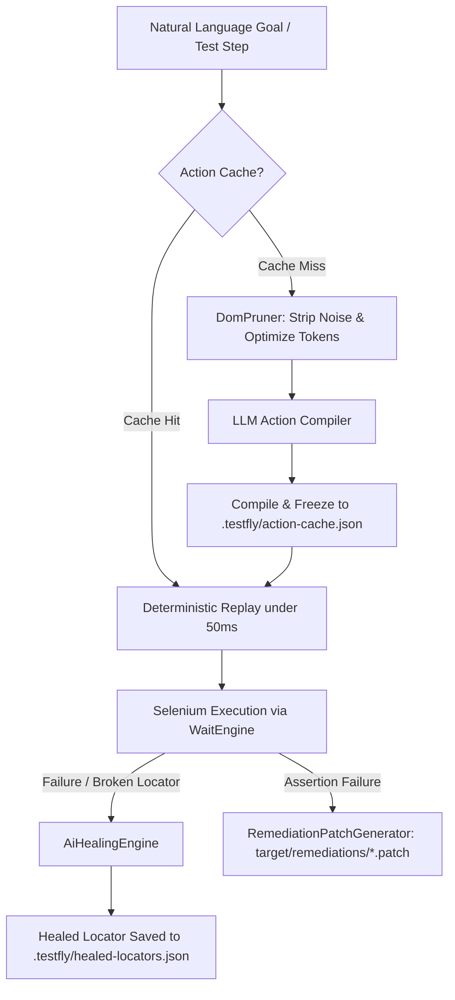

# Agentic Testing & Autonomous AI in TestFly

Traditional test automation requires test engineers to imperatively script every single step and selector. When an application's DOM structure, ID, or styling changes, tests break immediately.

**TestFly Agentic Testing** introduces autonomous AI capabilities directly into the runtime while preserving strict Java 17 performance, deterministic execution, and `@TestFlyApi` stability.



---

## 1. AI-Driven Self-Healing

When a selector breaks due to front-end refactorings, TestFly first attempts fast static regex fallbacks. If all static fallbacks fail and `locators.aiHealing: true` is configured, TestFly activates the **AiHealingEngine**:

1. **Token-Budgeted DOM Pruning (`DomPruner`):**  
   Strips `<script>`, `<style>`, `<iframe>`, inline SVGs, comments, and non-interactive nodes, reducing typical 100K+ token DOM trees to under 8K tokens while strictly preserving semantic attributes (`id`, `name`, `data-testid`, `role`, `aria-*`, text content).
2. **AI Locator Synthesis:**  
   Asks the configured LLM to find the element based on its semantic intent, test context, and pruned DOM.
3. **Persistent Caching:**  
   Successfully healed locators are stored in `.testfly/healed-locators.json`. Future runs resolve the healed locator instantly with **0 ms AI latency**.

### Configuration

```yaml
locators:
  selfHealing: true
  aiHealing: true        # Enable LLM fallback when static fallbacks fail
  maxDomTokens: 8000     # Maximum tokens sent to LLM during healing
```

---

## 2. Semantic Assertions (`satisfiesAi` & `violatesAi`)

Asserting complex page state or visual conditions using brittle string assertions can be fragile. Semantic assertions use LLM reasoning to evaluate natural language conditions against the live DOM:

### Page-Level Semantic Assertions

```java
// In BaseTest or BasePage:
assertThatPage().satisfiesAi("The order confirmation summary is displayed with an order number");

// Or using the convenience helper:
assertWithAi("A successful payment confirmation banner is visible");

// Forbidden conditions (negative checks):
assertThatPage().violatesAi("Contains error alert 500 or out-of-stock warning");
```

### Element-Level Semantic Assertions

```java
// Inspects only the targeted element's sub-tree
find(".discount-badge").satisfiesAi("Shows a percentage discount greater than 20%");
find("#status-pill").violatesAi("Expired or cancelled subscription tag");
```

### Anti-Throttle Protection
Unlike traditional element polling (which checks every 500ms), `satisfiesAi` evaluates the DOM once, ensuring you never encounter API rate limits or excessive LLM costs.

---

## 3. Goal-Oriented Dynamic Steps (`act`) & Compile & Freeze

TestFly allows executing high-level, natural language goals via `act(String goal)`.

```java
@Test
public void checkoutTest() {
    open("https://shop.example.com/cart");

    // High-level goal-oriented action
    act("Delete the first item in the shopping cart");

    // Dynamic intent locator
    byIntent("Proceed to checkout button").click();

    // Semantic assertion
    assertWithAi("User is redirected to shipping address form");
}
```

### The "Compile & Freeze" Guarantee
When `act("...")` is called:
- **Run 1 (Compile):** The agent inspects the pruned DOM, synthesizes an ordered list of concrete Selenium actions (`CLICK`, `TYPE`, `WAIT_VISIBLE`), and executes them.
- **Freeze:** The compiled action plan is saved into `.testfly/action-cache.json`.
- **Run 2+ (Freeze Replay):** Subsequent test runs replay the cached plan directly via standard Selenium `WaitEngine` with **zero LLM latency (under 50ms)**.
- **Resilience:** If the UI changes and a cached action fails, TestFly automatically invalidates the cache, recompiles the plan, and executes the fresh steps.

---

## 4. AI-Powered Self-Remediation (Auto-PR Patches)

When an assertion or locator fails permanently, TestFly does not just output a stack trace. With `ai.generatePatch: true`, TestFly analyzes the root cause and generates a **Unified Git Diff `.patch`** in `target/remediations/`.

### Example Generated Patch (`target/remediations/CheckoutTest_validOrder.patch`)

```diff
--- a/src/test/java/com/example/pages/CheckoutPage.java
+++ b/src/test/java/com/example/pages/CheckoutPage.java
@@ -24,3 +24,3 @@
-    private static final By SUBMIT_BTN = By.id("submit-order");
+    private static final By SUBMIT_BTN = By.cssSelector("button[data-testid='complete-purchase']");
```

### Applying the Patch

Developers or CI bots can apply the generated patch in one command:

```bash
git apply target/remediations/CheckoutTest_validOrder.patch
```

---

## 5. Configuration Reference

```yaml
ai:
  provider: claude        # or "gemini", "openai", "deepseek"
  apiKey: "${AI_API_KEY}" # Environment variable injection
  model: claude-haiku-4-5-20251001
  timeoutSeconds: 20
  failureAnalysis: true   # Root cause explanation in HTML reports
  generatePatch: true     # Generate unified git diff .patch files on test failure
  actionCache: true       # Enable Compile & Freeze action plan caching (default: true)

locators:
  selfHealing: true
  aiHealing: true         # Enable AI self-healing fallback
  maxDomTokens: 8000      # DOM pruning token threshold
```
