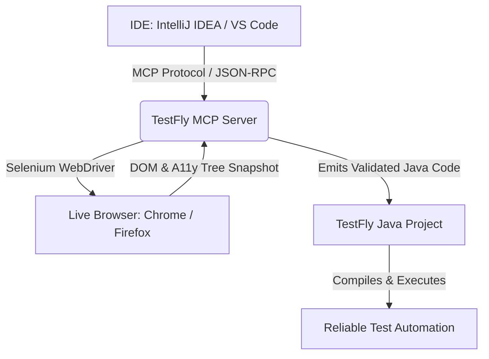

# AI & MCP Automation Overview

Modern AI coding assistants (such as **JetBrains AI Assistant**, **Claude Code**, **GitHub Copilot**, and **Google Antigravity**) can write code, but when asked to automate web tests, raw LLMs face severe limitations:
- **Blind Generation:** They cannot see the actual DOM, layout, or accessibility attributes of your web application.
- **Hallucinated Locators:** They invent brittle XPath selectors or IDs that do not exist on the page.
- **Outdated Code Patterns:** They default to raw `Thread.sleep()` or deprecated Selenium APIs rather than robust, auto-waiting test frameworks.

**TestFly solves this with the Model Context Protocol (MCP).**

---

## What is TestFly MCP?

**TestFly MCP** is a Python-based server implementing the [Model Context Protocol (MCP)](https://modelcontextprotocol.io/). It bridges your IDE's AI assistant with live, real-world browser execution:

### Key Capabilities

1. **Real Browser Inspection:** AI assistants drive a real browser session (Chrome/Firefox) via 88 automated MCP tools, navigating to real URLs and inspecting genuine interactive elements.
2. **Accessibility-First Locators:** Locators are derived directly from the browser's accessibility tree (`getByRole`, `getByLabel`, `getByTestId`, `getByPlaceholder`), making tests resilient against UI redesigns.
3. **Native TestFly Codegen:** Instead of writing raw Selenium boilerplate, the MCP server emits production-grade TestFly Java code:
   - **Page Object Model:** Classes extending `BasePage` with fluent action methods.
   - **TestNG Tests:** Classes extending `BaseTest` with framework-managed driver lifecycles.
   - **JUnit 5 Tests:** Classes extending `BaseJUnit5Test`.
   - **Cucumber BDD:** Steps extending `BaseCucumberSteps` and runners extending `BaseCucumberTest`.
   - **Web-First Assertions:** Auto-waiting `assertThat(getDriver()).hasTitle(...)` and `assertThat(locator).isVisible()`.

---

## Ecosystem Components

The TestFly AI ecosystem consists of 5 tightly integrated components:

| Component | Purpose | How to Access |
| :--- | :--- | :--- |
| **Agentic Testing Runtime** | Embedded Java engine for goal actions (`act()`), semantic assertions (`assertWithAi()`), intent locators (`byIntent()`), self-healing, and auto-remediation patches. | Built-in Java library: `io.testfly:testfly` |
| **`testfly-mcp` Server** | Python MCP server exposing 88 tools to AI assistants via standard I/O. | `pip install -e .` or CLI: `testfly-mcp` |
| **IntelliJ IDEA Plugin** | Zero-config registration with JetBrains AI Assistant, diagnostics, and project bootstrap. | Disk installation: `testfly-mcp-jetbrains-1.0.0.zip` |
| **VS Code Extension** | Auto-registration for Claude Code & GitHub Copilot, status bar menu, and config generator. | VSIX installation: `testfly-mcp-1.0.0.vsix` |
| **Interactive Web Studio** | Zero-dependency browser dashboard for visual playground testing and codegen. | CLI command: `testfly-mcp ui` |

---

## Next Steps

- [Agentic Testing & Autonomous AI](./agentic-testing) — Goal-oriented execution, Compile & Freeze caching, semantic assertions, and self-remediation.
- [TestFly MCP Server & CLI](./testfly-mcp) — Learn about installation, the 88 MCP tools, and command-line usage.
- [IDE Plugins & Extensions](./ide-plugins) — Set up the IntelliJ IDEA and VS Code plugins.
- [Interactive Web Studio](./interactive-studio) — Use the visual browser playground and live codegen studio.
- [Prompt Recipes](./prompt-recipes) — Copy-paste prompt templates for generating Page Objects, TestNG, JUnit 5, and Cucumber tests.
