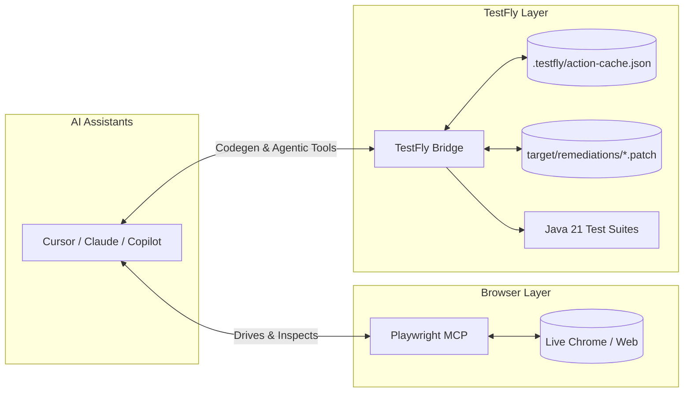

# TestFly MCP Bridge & Playwright Integration

The **TestFly MCP Bridge** is a lightweight, zero-dependency [Model Context Protocol (MCP)](https://modelcontextprotocol.io/) server that connects AI coding assistants (**Cursor**, **Claude Desktop**, **GitHub Copilot**, and **Claude Code**) to the TestFly Java ecosystem.

Instead of maintaining a heavy, fragile browser automation driver in Python, TestFly adopts the modern **Bring Your Own Browser** pattern:

1. **Browser Driving:** Delegated to the official, ultra-fast **Playwright MCP** (`@modelcontextprotocol/server-playwright`).
2. **TestFly Intelligence & Codegen:** Handled by the **TestFly Bridge** (`@testfly/mcp`), which compiles browser interactions into idiomatic TestFly Java 21 tests (`BaseTest`, `BasePage`, `getByRole`, `assertThat`), manages the `.testfly/action-cache.json` autonomous plan cache, and applies AI self-healing `.patch` files.



---

## ⚡ Quick 1-Click Setup

### Option 1: Via TestFly VS Code Extension (Recommended)
1. Install the **TestFly Studio** extension (`testfly-vscode-1.1.0.vsix`).
2. Open the Command Palette (`Cmd + Shift + P` or `Ctrl + Shift + P`).
3. Select **`TestFly: 1-Click Multi-Assistant MCP Setup`**.
4. Both Playwright MCP and TestFly Bridge are automatically configured for **Cursor**, **Claude Desktop**, and **VS Code Native Copilot**.

---

### Option 2: Manual JSON Configuration

Add both servers to your assistant's configuration file (e.g. `~/.cursor/mcp.json` or `claude_desktop_config.json`):

```json
{
  "mcpServers": {
    "playwright": {
      "command": "npx",
      "args": ["-y", "@modelcontextprotocol/server-playwright"]
    },
    "testfly": {
      "command": "npx",
      "args": ["-y", "@testfly/mcp"]
    }
  }
}
```

No Python, pip, uv, or virtual environments required. Only **Node.js 18+** is needed.

---

## 🛠️ MCP Tools Reference

The TestFly Bridge exposes 7 focused, high-value tools to AI agents:

| Tool | Parameters | Description |
| :--- | :--- | :--- |
| `generate_testfly_code` | `actions`, `className`, `packageName`, `framework` | Compiles recorded actions into Java 21 TestFly tests (`BaseTest`, `BasePage`, `getByRole`, `assertThat`). |
| `inspect_action_cache` | `workspaceRoot` | Reads and inspects autonomous `act("Goal")` plans frozen in `.testfly/action-cache.json` for 0ms replay. |
| `manage_action_cache` | `workspaceRoot`, `action`, `goal` | Invalidates specific cached goals or clears the entire cache to force LLM re-compilation. |
| `list_remediations` | `workspaceRoot` | Lists pending AI self-healing git diff `.patch` files generated by `AiHealingEngine` in `target/remediations/`. |
| `apply_remediation_patch` | `workspaceRoot`, `patchFilePath` | Applies a synthesized `.patch` file directly to the test Java source code via `git apply`. |
| `init_testfly_project` | `directory` | Scaffolds a complete TestFly 1.0.6 + Java 21 Maven test automation suite (`pom.xml`, `testfly.yml`, smoke test). |
| `calculate_shards` | `totalNodes`, `targetNodeIndex`, `items` | Computes optimal parallel test execution across CI nodes using LPT (Longest Processing Time) bin packing. |

---

## 🤖 End-to-End Workflow: How AI Writes Tests

Here is how an AI assistant (like Cursor or Claude) uses this setup:

1. **Step 1 — Navigate & Inspect:**  
   The AI calls Playwright MCP (`browser_navigate`) to open `https://example.com` and inspects the live accessibility tree (`browser_snapshot`).
2. **Step 2 — Interact:**  
   The AI interacts with elements using Playwright MCP (`browser_click`, `browser_type`).
3. **Step 3 — Generate TestFly Java Code:**  
   The AI calls TestFly Bridge (`generate_testfly_code`) passing the recorded actions. The bridge returns compile-ready Java 21 code:
   ```java
   package io.testfly.examples.testng;

   import io.testfly.locator.Role;
   import io.testfly.locator.RoleOptions;
   import io.testfly.test.BaseTest;
   import org.testng.annotations.Test;

   public class LoginTest extends BaseTest {

       @Test
       public void executeRecordedFlow() {
           open();
           getByRole(Role.TEXTBOX, new RoleOptions().setName("Username")).type("standard_user");
           getByRole(Role.TEXTBOX, new RoleOptions().setName("Password")).type("secret_sauce");
           getByRole(Role.BUTTON, new RoleOptions().setName("Login")).click();
           assertThatPage().hasUrl("https://example.com/inventory.html");
       }
   }
   ```
4. **Step 4 — Save & Run:**  
   The AI saves the code to `src/test/java/...` and runs `mvn test`. Zero boilerplate, zero flakiness.
