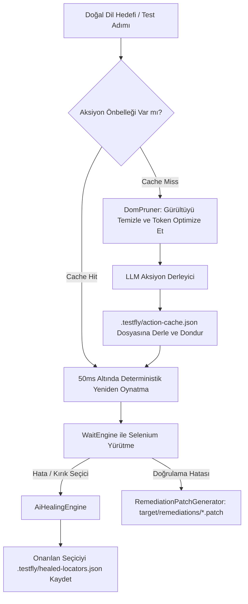

# TestFly'da Agentic Testing & Otonom AI

Geleneksel test otomasyonunda mühendislerin arayüzdeki her adımı, tıklamayı ve seçiciyi (locator) tek tek kodlaması gerekir. Uygulamanın DOM yapısı, ID'si veya tasarımı değiştiğinde testler anında kırılır.

**TestFly Agentic Testing**, otonom yapay zeka yeteneklerini doğrudan test çalışma zamanına entegre ederken Java 17 performansını, deterministik yürütmeyi ve `@TestFlyApi` geriye dönük kararlılığını korur.



---

## 1. AI Destekli Gelişmiş Self-Healing (Kendi Kendini Onarma)

Arayüz refactoring süreçlerinde bir element seçicisi patladığında TestFly önce hızlı statik regex alternatiflerini (ID, name, metin eşleşmesi) dener. Tüm statik kurallar tükenirse ve `locators.aiHealing: true` ayarlanmışsa **AiHealingEngine** devreye girer:

1. **Token Bütçeli DOM Budama (`DomPruner`):**  
   `<script>`, `<style>`, `<iframe>`, inline SVG'ler, yorum satırları ve etkileşimsiz düğümleri ayıklayarak 100K+ tokenlık devasa DOM ağaçlarını **8K token altına** indirir; `id`, `name`, `data-testid`, `role`, `aria-*` ve metin içeriklerini eksiksiz korur.
2. **AI Seçici Türetme:**  
   Yapılandırılmış LLM modeline budanmış DOM ve test bağlamını ileterek semantik olarak eşleşen yeni bir Selenium `By` seçicisi üretir.
3. **Kalıcı Önbellekleme:**  
   Onarılan seçici `.testfly/healed-locators.json` dosyasına `"ai-healed"` etiketiyle yazılır. Sonraki test koşularında doğrudan bu seçici kullanılır ve **0 ms AI gecikmesiyle** çalışır.

### Yapılandırma (`testfly.yml`)

```yaml
locators:
  selfHealing: true
  aiHealing: true        # Statik alternatifler tükendiğinde LLM tabanlı onarımı etkinleştirir
  maxDomTokens: 8000     # LLM'e gönderilecek azami token sınırı
```

---

## 2. Semantik Doğrulamalar (`satisfiesAi` & `violatesAi`)

Karmaşık sayfa durumlarını veya görsel şartları kırılgan metin eşleştirmeleriyle doğrulamak zordur. Semantik doğrulamalar, canlı DOM üzerinde doğal dil kurallarını büyük dil modelleriyle akıl yürüterek denetler:

### Sayfa Düzeyinde Semantik Doğrulamalar

```java
// BaseTest, BasePage, BaseJUnit5Test veya BaseCucumberSteps içinde:
assertThatPage().satisfiesAi("Kullanıcı giriş yapmış ve sipariş özeti ekranı sipariş numarasıyla görüntüleniyor");

// Veya pratik yardımcı metot ile:
assertWithAi("Başarılı ödeme onay bildirimi sayfada mevcut");

// Yasaklı / Hatalı durum kontrolleri (negatif denetim):
assertThatPage().violatesAi("500 sunucu hatası veya stok tükendi uyarısı var");
```

### Element Düzeyinde Semantik Doğrulamalar

Aramayı belirli bileşenler ve alt ağaçlarla sınırlandırarak token maliyetini düşürebilir ve odağı daraltabilirsiniz:

```java
// Sadece ilgili elementin alt ağacını inceler
assertThat(find(".discount-badge")).satisfiesAi("%20'den yüksek bir indirim oranını gösteriyor");
assertThat(find("#status-pill")).violatesAi("Süresi dolmuş veya iptal edilmiş abonelik etiketi");
```

### Anti-Throttle Koruması (Kota Aşımı Engelleme)
Geleneksel element bekleme döngülerinin (her 500ms'de bir sorgulama) aksine `satisfiesAi`, DOM'u tek seferde değerlendirir. Böylece API kotası tükenmez ve gereksiz maliyet oluşmaz. Ayrıca Soft Assertions ile tam uyumludur:

```java
softAssertThatPage().satisfiesAi("Kullanıcı selamlama mesajı görünüyor");
softAssertThatPage().violatesAi("Uyarı penceresi");
// Test sonunda assertAll() ile topluca değerlendirilir
```

---

## 3. Hedef Odaklı Akıllı Aksiyonlar (`act`) & Niyet Seçicileri (`byIntent`)

TestFly, yüksek seviyeli doğal dil hedeflerini `act(String goal)` metoduyla otonom olarak yürütmenizi sağlar:

```java
@Test
public void checkoutTest() {
    open("https://shop.example.com/cart");

    // Doğal dille hedef odaklı aksiyon
    act("Sepetteki ilk ürünü sil");

    // Dinamik niyet seçicisi (intent locator)
    byIntent("Ödeme adımına ilerle butonu").click();

    // Semantik doğrulama
    assertWithAi("Kullanıcı teslimat adresi formuna yönlendirildi");
}
```

### Desteklenen Aksiyon Tipleri
AI derleyicisi doğal dille verilen hedefleri deterministik `ActionStep` adımlarına dönüştürür:
- `CLICK`: Buton, link veya seçim kutularına tıklar.
- `TYPE`: Giriş alanlarına metin yazar.
- `CLEAR`: Mevcut metin kutusunun içeriğini temizler.
- `HOVER`: Fareyi gezinme menülerinin üzerine getirir.
- `WAIT_VISIBLE`: Asenkron yüklenen bileşenlerin görünür olmasını bekler.
- `PRESS_ENTER`: Arama ve form alanlarında Enter tuşuna basar.

---

## 4. "Compile & Freeze" Önbellek Garantisi

Otonom test ajanlarının en büyük handikapı yavaşlık ve kararsızlıktır (non-determinism). TestFly bu sorunu **Compile & Freeze (Derle ve Dondur)** mekanizmasıyla kökünden çözer:

- **1. Koşu (Derleme):** Ajan budanmış DOM'u analiz eder, somut Selenium aksiyon adımlarını (`CLICK`, `TYPE`, `WAIT_VISIBLE`) üretir ve sırayla çalıştırır.
- **Dondurma (Freeze):** Derlenen eylem planı `.testfly/action-cache.json` dosyasına kaydedilir.
- **2+ Koşular (Dondurulmuş Planın Yeniden Oynatılması):** Sonraki tüm test koşularında LLM'e hiç gitmeden, önbellekteki plan doğrudan standart Selenium `WaitEngine` ile **50 ms'nin altında ve sıfır AI gecikmesiyle** çalıştırılır.
- **Otomatik İyileşme (Self-Recovery):** Arayüz değişip önbellekteki adımlardan biri başarısız olursa TestFly önbellek girdisini otomatik düşürür, yeni DOM'a göre planı yeniden derler ve testi kurtarır.

```json
// Örnek .testfly/action-cache.json girdisi
{
  "/cart::remove first item" : {
    "goal" : "Remove first item",
    "urlPattern" : "/cart",
    "steps" : [ {
      "action" : "CLICK",
      "locator" : ".remove-item",
      "value" : null,
      "description" : "Click remove"
    } ],
    "createdAt" : 1788723827530
  }
}
```

---

## 5. AI Hata Onarım Yaması (Self-Remediation / Auto-PR)

Bir doğrulama veya seçici kalıcı olarak başarısız olduğunda TestFly sadece hata yığını basmakla kalmaz. `ai.generatePatch: true` etkinleştirildiğinde hatanın kök nedenini analiz eder, `SourceCodeLocator` ile ilgili test veya Page Object sınıfındaki satırları bulur ve `target/remediations/` dizinine standart **Unified Git Diff `.patch`** dosyası üretir.

### Örnek Üretilen Yama (`target/remediations/CheckoutTest_validOrder.patch`)

```diff
--- a/src/test/java/com/example/pages/CheckoutPage.java
+++ b/src/test/java/com/example/pages/CheckoutPage.java
@@ -24,3 +24,3 @@
-    private static final By SUBMIT_BTN = By.id("submit-order");
+    private static final By SUBMIT_BTN = By.cssSelector("button[data-testid='complete-purchase']");
```

### Yamanın Uygulanması

Geliştiriciler veya CI botları üretilen yamayı tek komutla kaynak koda uygulayabilir:

```bash
git apply target/remediations/CheckoutTest_validOrder.patch
```

---

## 6. Örnek Projeler ve Kullanım Kalıpları

TestFly kaynak kodunda `src/test/java/io/testfly/examples/` altında üretime hazır örnekler yer almaktadır:

### Page Object Model (`SauceDemoAgenticPage.java`)

```java
public class SauceDemoAgenticPage extends BasePage {

    public SauceDemoAgenticPage(WebDriver driver) {
        super(driver);
    }

    public SauceDemoAgenticPage loginWithAgent(String username, String password) {
        act("Enter username '" + username + "' and password '" + password + "', then click Login");
        return this;
    }

    public SauceDemoAgenticPage openShoppingCart() {
        byIntent("shopping cart link or button").click();
        return this;
    }

    public SauceDemoAgenticPage verifyInventoryDisplayed() {
        assertWithAi("The page displays an inventory grid with items and Add to cart buttons");
        assertThatPage().violatesAi("Shows error message or authentication failure banner");
        return this;
    }
}
```

### TestNG Paketi (`SauceDemoAgenticTest.java`)

```java
public class SauceDemoAgenticTest extends BaseTest {

    @Test(description = "Hedef odaklı eylemleri ve semantik doğrulamaları sergiler")
    public void autonomousECommerceFlow() {
        open();

        // 1. Otonom Giriş: (TYPE user -> TYPE pass -> CLICK login) adımlarına derlenir
        act("Enter username 'standard_user' and password 'secret_sauce', then click the login button");

        // 2. Semantik Sayfa Doğrulaması
        assertWithAi("The user is logged in and products catalog is displayed");
        assertThatPage().violatesAi("Error banner, access denied, or session timeout notice");

        // 3. Dinamik Niyet Eylemi
        byIntent("Checkout button").click();

        // 4. Element Düzeyinde Semantik Doğrulama
        assertThat(find(".checkout_info")).satisfiesAi("Contains First Name, Last Name, and Postal Code fields");
    }
}
```

### JUnit 5 Paketi (`SauceDemoAgenticJUnit5Test.java`)

```java
@DisplayName("SauceDemo Agentic Testing (JUnit 5)")
class SauceDemoAgenticJUnit5Test extends BaseJUnit5Test {

    @Test
    @DisplayName("Compile & Freeze Action Caching ile otonom akış")
    void autonomousLoginAndCartFlow() {
        open();
        act("Log in with username 'standard_user' and password 'secret_sauce'");
        assertWithAi("The products catalog is visible with inventory items");
        assertThatPage().violatesAi("Error banner or invalid credentials message");
        act("Add the first product to cart and open the shopping cart");
        assertThatPage().satisfiesAi("Shopping cart contains one item");
    }
}
```

### Cucumber BDD (`agentic_saucedemo.feature` & `SauceDemoSteps.java`)

```gherkin
Feature: Agentic E-Commerce Automation with TestFly

  Background:
    Given the user is on the Sauce Demo login page

  @Agentic
  Scenario: Autonomous login and cart flow
    When the agent executes goal "Enter username 'standard_user' and password 'secret_sauce', then click Login"
    Then the page satisfies AI condition "The user is logged in and the products catalog is displayed"
    And the page violates AI condition "Error banner or locked out message"
    When the agent executes goal "Add the backpack to the cart and navigate to the cart"
    Then the page satisfies AI condition "Shopping cart contains Sauce Labs Backpack"
```

Step definition (`SauceDemoSteps.java`):

```java
public class SauceDemoSteps extends BaseCucumberSteps {

    @When("the agent executes goal {string}")
    public void executeAgentGoal(String goal) {
        act(goal);
    }

    @Then("the page satisfies AI condition {string}")
    public void verifyPageSatisfiesAi(String condition) {
        assertWithAi(condition);
    }

    @Then("the page violates AI condition {string}")
    public void verifyPageViolatesAi(String condition) {
        assertThatPage().violatesAi(condition);
    }
}
```

---

## 7. Örnekleri Maven CLI ile Çalıştırma

Örnek test paketlerini terminalinizden doğrudan koşturabilirsiniz:

```bash
# AI API anahtarınızı tanımlayın
export AI_API_KEY="your-api-key"

# TestNG Agentic Örneği
mvn test -Dtest=io.testfly.examples.testng.SauceDemoAgenticTest

# JUnit 5 Agentic Örneği
mvn test -Dtest=io.testfly.examples.junit5.SauceDemoAgenticJUnit5Test

# Cucumber BDD Agentic Senaryoları
mvn test -Dtest=io.testfly.examples.cucumber.SauceDemoAgenticCucumberRunner
```

---

## 8. CI/CD Entegrasyonu ve Yapay Zeka Çıktılarını Arşivleme

CI ortamlarında TestFly otomatik olarak AI artefaktlarını arşivlemenize imkan tanır.

### GitHub Actions (`.github/workflows/testfly-ci.yml`)

```yaml
- name: Archive AI Agentic Artifacts
  if: always()
  uses: actions/upload-artifact@v4
  with:
    name: ai-agentic-artifacts
    path: |
      target/remediations/*.patch
      .testfly/**
    retention-days: 14
```

### Jenkins Pipeline (`ci/Jenkinsfile`)

```groovy
post {
    always {
        archiveArtifacts artifacts: 'target/remediations/*.patch, .testfly/**', allowEmptyArchive: true
    }
}
```

---

## 9. Tam Yapılandırma Referansı

`testfly.yml` dosyanıza şu blokları ekleyebilirsiniz:

```yaml
ai:
  provider: claude        # Desteklenenler: "claude", "gemini", "openai", "deepseek"
  apiKey: "${AI_API_KEY}" # Ortam değişkeninden enjekte edilir
  model: claude-haiku-4-5-20251001
  timeoutSeconds: 20
  failureAnalysis: true   # HTML raporunda hata kök nedenini açıklar
  generatePatch: true     # Test patladığında Unified Git Diff .patch üretir
  actionCache: true       # Compile & Freeze önbelleğini açar (varsayılan: true)

locators:
  selfHealing: true       # Kural tabanlı statik yedekleri açar
  aiHealing: true         # Statik kurallar bittiğinde LLM yedeklemesini açar
  maxDomTokens: 8000      # DOM budama token sınırı
```

| Parametre | Tip | Varsayılan | Açıklama |
| :--- | :--- | :--- | :--- |
| `ai.provider` | `String` | `"claude"` | LLM sağlayıcısı (`claude`, `gemini`, `openai`, `deepseek`). |
| `ai.apiKey` | `String` | `""` | API anahtarı (`${AI_API_KEY}` formatında). |
| `ai.model` | `String` | sağlayıcı varsayılanı | Model adı (ör. `claude-haiku-4-5-20251001`, `gemini-1.5-flash`). |
| `ai.failureAnalysis` | `Boolean` | `false` | HTML raporunda kök neden analizi üretir. |
| `ai.generatePatch` | `Boolean` | `false` | Test patladığında `target/remediations/*.patch` üretir. |
| `ai.actionCache` | `Boolean` | `true` | Compile & Freeze eylem önbelleğini yönetir. |
| `locators.selfHealing` | `Boolean` | `false` | Kural tabanlı statik self-healing. |
| `locators.aiHealing` | `Boolean` | `false` | LLM destekli semantik self-healing alternatifi. |
| `locators.maxDomTokens` | `Integer` | `8000` | DOM budama token üst sınırı. |
