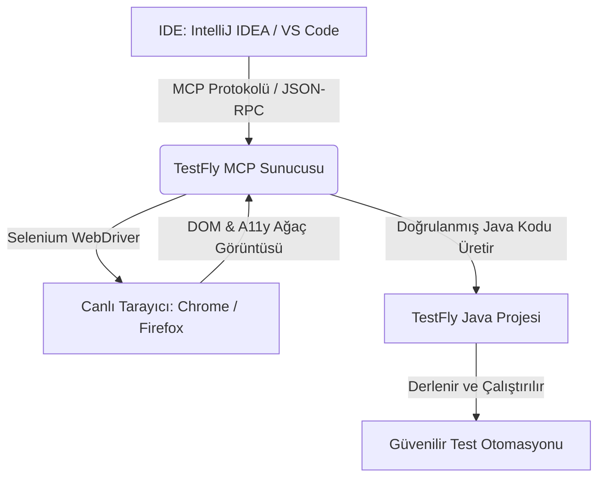

# Yapay Zeka (AI) & MCP Otomasyonuna Genel Bakış

Günümüzün modern yapay zeka kodlama asistanları (**JetBrains AI Assistant**, **Claude Code**, **GitHub Copilot** ve **Google Antigravity**) kod yazabilir; ancak web test otomasyonuna gelindiğinde klasik büyük dil modelleri (LLM) ciddi sınırlarla karşılaşır:
- **Kör Kod Üretimi:** Web uygulamanızın gerçek DOM'unu, görsel düzenini veya erişilebilirlik niteliklerini göremezler.
- **Hayali / Kırılgan Seçiciler (Halüsinasyon):** Sayfada hiç bulunmayan XPath veya ID'ler uydururlar.
- **Eski ve Hatalı Kod Desenleri:** Çerçevenizin modern API'ları yerine eski `Thread.sleep()` veya ham Selenium kalıpları yazarlar.

**TestFly bu sorunu Model Context Protocol (MCP) ile çözer.**

---

## TestFly MCP Nedir?

**TestFly MCP**, açık standart [Model Context Protocol (MCP)](https://modelcontextprotocol.io/) protokolünü uygulayan Python tabanlı bir sunucudur. IDE'nizdeki AI asistanı ile canlı tarayıcı oturumu arasında köprü kurar:

### Temel Yetenekler

1. **Gerçek Tarayıcı Denetimi:** AI asistanları 88 otomatik MCP aracıyla gerçek bir tarayıcıyı (Chrome/Firefox) yönetir, verilen URL'ye gider ve canlı öğeleri tarar.
2. **Erişilebilirlik Odaklı Seçiciler (a11y-first):** Locator'lar doğrudan tarayıcının erişilebilirlik ağacından (`getByRole`, `getByLabel`, `getByTestId`, `getByPlaceholder`) türetilir; arayüz tasarımları değişse bile testler kırılmaz.
3. **Yerel TestFly Kod Üretimi:** Ham Selenium şablonları yerine doğrudan kurumsal TestFly Java kodları üretilir:
   - **Page Object Modeli:** `BasePage` extend eden ve akıcı (fluent) eylem metotları içeren sınıflar.
   - **TestNG Testleri:** `BaseTest` extend eden, driver yaşam döngüsü otomatik yönetilen sınıflar.
   - **JUnit 5 Testleri:** `BaseJUnit5Test` extend eden sınıflar.
   - **Cucumber BDD:** `BaseCucumberSteps` extend eden adımlar ve `BaseCucumberTest` runner'ı.
   - **Akıllı Doğrulamalar:** `assertThat(getDriver()).hasTitle(...)` ve `assertThat(locator).isVisible()`.

---

## Ekosistem Bileşenleri

TestFly AI ekosistemi 5 ana bileşenden oluşur:

| Bileşen | Görevi | Nasıl Erişilir |
| :--- | :--- | :--- |
| **Agentic Testing Çalışma Zamanı** | Doğal dil hedefleri (`act()`), semantik doğrulamalar (`assertWithAi()`), niyet seçicileri (`byIntent()`), AI self-healing ve otomatik yama (auto-PR) motoru. | Yerleşik Java kütüphanesi: `io.testfly:testfly` |
| **`testfly-mcp` Sunucusu** | AI asistanlarına standart I/O üzerinden 88 araç sunan Python MCP sunucusu. | `pip install -e .` veya CLI: `testfly-mcp` |
| **IntelliJ IDEA Eklentisi** | JetBrains AI Assistant ile sıfır konfigürasyonlu kayıt, sistem teşhisi ve proje başlatma. | Diskten kurulum: `testfly-mcp-jetbrains-1.0.0.zip` |
| **VS Code Eklentisi** | Claude Code & GitHub Copilot için otomatik kayıt, durum çubuğu menüsü. | VSIX kurulumu: `testfly-mcp-1.0.0.vsix` |
| **Etkileşimli Web Stüdyosu** | Tarayıcı üzerinden görsel test yapma ve kod üretme paneli. | CLI komutu: `testfly-mcp ui` |

---

## Sonraki Adımlar

- [Agentic Testing & Otonom AI](./agentic-testing) — Hedef odaklı test adımları, Compile & Freeze önbelleği, semantik doğrulamalar ve otomatik hata yamaları.
- [TestFly MCP Sunucusu ve CLI](./testfly-mcp) — Kurulum, 88 MCP aracı ve komut satırı kullanımı.
- [IDE Eklentileri](./ide-plugins) — IntelliJ IDEA ve VS Code eklentilerinin kurulumu.
- [Etkileşimli Web Stüdyosu](./interactive-studio) — Görsel tarayıcı denetimi ve anlık kod üretimi.
- [Hazır AI Prompt Şablonları](./prompt-recipes) — Page Object, TestNG, JUnit 5 ve Cucumber testleri üreten kopyala-yapıştır prompt şablonları.
