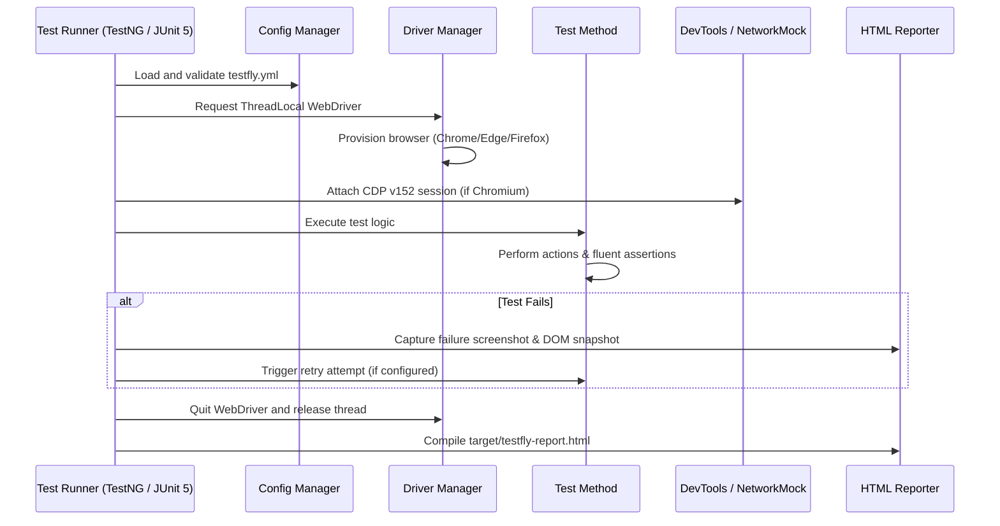

# TestFly – Architecture Overview

This document describes the high-level architecture of TestFly, including its core components, design boundaries, and execution flow.

The architecture is intentionally simple, opinionated, and extensible only at well-defined points.

---

## Architectural Goals

The architecture of TestFly is designed to:

- Minimize Selenium framework boilerplate across web, API, and BDD tests
- Enforce consistent, thread-isolated execution patterns across parallel test runs
- Reduce flakiness through standardized explicit waits and smart auto-retries
- Remain transparent to native Selenium WebDriver APIs without hiding or obfuscating them
- Provide unified observability (HTML report, Allure, ReportPortal) with zero configuration
- Power AI test generation via the official Model Context Protocol (TestFly MCP)

---

## Layered Architecture

TestFly follows a layered, responsibility-driven architecture:

```
┌────────────────────────────────────────────────────────┐
│                   Test Layer (User)                    │
│   TestNG (BaseTest) · JUnit 5 (BaseJUnit5Test)         │
│   Cucumber 7 BDD (@TestFlySession) · Page Objects      │
└───────────────────────────┬────────────────────────────┘
                            │
┌───────────────────────────▼────────────────────────────┐
│                      TestFly Core                      │
│   Lifecycle Orchestrator · ThreadLocal Driver Manager │
│   Fluent Locators & Assertions (PageAssert, Locator)  │
│   Network Mocking (CDP v152) · REST API Client        │
│   Precondition Session Cache · WaitEngine & Retries   │
└───────────────────────────┬────────────────────────────┘
                            │
┌───────────────────────────▼────────────────────────────┐
│                  Infrastructure Layer                  │
│   YAML Config Loader (testfly.yml) · Profile Resolver  │
│   Interactive HTML Reporter · Allure / ReportPortal   │
│   Selenium Manager (Driver Binary Resolver)           │
└───────────────────────────┬────────────────────────────┘
                            │
┌───────────────────────────▼────────────────────────────┐
│                     Selenium 4 (CDP)                   │
│   Chromium (Chrome/Edge) · Firefox · Safari · Grid    │
└────────────────────────────────────────────────────────┘
```

---

## Layer Responsibilities

### 1. Test Layer (User-Owned)

Responsibilities:
- Test classes written in TestNG, JUnit 5, or Cucumber BDD
- Page Object Models extending `BasePage`
- Business-level assertions using `assertThat(locator)` and `assertThatPage()`
- API endpoint verification using `api()`

Rules:
- No manual `new ChromeDriver()` or `driver.quit()` in tests
- No static WebDriver variables
- Page Objects do not contain assertions

---

### 2. TestFly Core (Framework-Owned)

Responsibilities:
- **Lifecycle Orchestration**: Automates driver start, pre-conditions, and teardown across TestNG, JUnit 5, and Cucumber.
- **ThreadLocal Isolation**: Ensures zero cross-thread driver contamination during parallel execution.
- **Fluent Locators & Assertions**: Auto-waiting locator factories (`find()`, `getByRole()`) and assertions.
- **Network Mocking (`page().route()`)**: Declarative request stubbing and routing over Chrome DevTools Protocol.
- **Unified REST API Client**: Built-in HTTP client with polling and JSONPath validation.
- **Session Caching**: Caches cookies and web storage via `@PreCondition` to skip repetitive UI logins.
- **Wait Engine & Retries**: Centralized explicit waits (preventing harmful implicit waits) and automated flakiness retry.

---

### 3. Infrastructure & Reporting Layer

Responsibilities:
- **Configuration Engine**: Loads and validates `testfly.yml`, merging system properties and environment variables.
- **HTML Reporting**: Generates a self-contained, interactive HTML report (`target/testfly-report.html`) containing execution timeline, flakiness radar, video recordings, and step-by-step screenshots.
- **Third-Party Reporting Adapters**: Out-of-the-box integration with Allure and ReportPortal.

---

### 4. Selenium & Browser Layer

Responsibilities:
- Native Selenium 4.48.0 WebDriver APIs and Chrome DevTools Protocol (CDP v152).
- Automated driver binary discovery via Selenium Manager (no manual chromedriver downloads needed).
- Support for Local (Chrome, Firefox, Edge, Safari) and Remote Grid execution.

---

## Execution Flow



---

## Architectural Constraints

1. **Strict Isolation**: No global static driver state. Every thread owns an independent browser session.
2. **Zero Implicit Waits**: Implicit waits are enforced at `0ms` to prevent compounding retry delays.
3. **Transparent APIs**: The native Selenium `WebDriver` instance is always accessible via `getDriver()` if custom Actions or JavaScript execution is needed.
